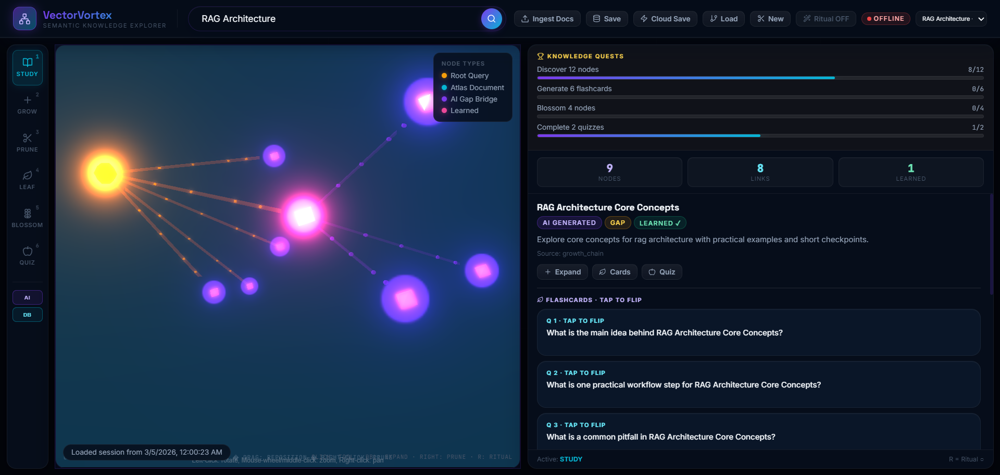

# VectorVortex - Semantic Knowledge Explorer for MongoDB

VectorVortex is a semantic search and knowledge exploration platform built for the **Hack-N-Go with MongoDB** challenge.

It transforms MongoDB from a system where users "search files" into a system where users **explore knowledge**.


## Team

- **Team Name**: VectorVortex
- **Team Size**: 1
- **Business Challenge**: Semantic Search Engine for MongoDB Documents

## Problem Statement Fit

Traditional keyword search fails when users do not know exact terms.
VectorVortex solves this using **MongoDB Atlas Vector Search** and AI embeddings to return results by **meaning and intent**, not exact keyword match.

This aligns with expected outcomes:

- Context-aware semantic search
- Natural language query understanding
- AI relevance matching
- Better discoverability in unstructured data
- Fast, API-driven search experience

## What Makes VectorVortex Different

- **Semantic Knowledge Tree UI**
  Search results are visualized as explorable branches, not a flat ranked list.
- **Exclusion-Aware Growth**
  Pruned/seen topics are used to avoid repetitive expansions and increase discovery diversity.
- **Search + Learning in One Flow**
  Flashcards and quizzes are generated directly from explored nodes.
- **Compatibility-First Visualization**
  Uses 3D graph when WebGL is available and automatically falls back when browser GPU/WebGL is restricted.

## Primary Users

- Students and researchers
- Business/data analysts
- Developers and DevOps teams
- Customer support teams

## Architecture

- **Frontend**: React + TypeScript + Vite
- **Backend API**: Node.js + Express
- **AI Layer**: LangChain with provider switch (Gemini / OpenAI / Groq)
- **Vector + Document Store**: MongoDB Atlas (`$vectorSearch`)
- **Embeddings**: `@xenova/transformers` (MiniLM) in app pipeline

## Core Modules

- Module A: Document ingestion (`/api/ingest`)
- Module B: Embedding pipeline and storage
- Module C: Semantic explore/search (`/api/explore`)
- Module D: Interactive knowledge tree UI
- Module E: Learning tools (`/api/flashcards`, `/api/fruit`)

## Key Features

- Natural language semantic exploration
- Tool-based graph interaction (Study, Grow, Prune, Cards, Learn, Quiz)
- Local and cloud session save/load
- Progress tracking via Knowledge Quests
- 3D mode with graceful fallback mode

## API Endpoints (Current)

- `GET /api/status`
- `POST /api/ingest`
- `POST /api/explore`
- `POST /api/flashcards`
- `POST /api/fruit`
- `POST /api/sessions/save`
- `GET /api/sessions`
- `GET /api/sessions/:id`

## Local Setup

### Prerequisites

- Node.js 18+
- npm
- MongoDB Atlas cluster with vector index configured (`vector_index`)

### 1) Clone and install

```bash
git clone https://github.com/theharshitamaurya/VectorVortex-luminous-mind-tree.git
cd VectorVortex-luminous-mind-tree
npm install
```

### 2) Configure environment

Create `.env` from `.env.example`:

```bash
cp .env.example .env
```

Set at minimum:

- `MONGODB_URI`
- One provider key (for selected `AI_PROVIDER`)

### 3) Run

```bash
npm run dev
```

App starts on `http://localhost:3000` (or next free port).

### 4) Build (optional)

```bash
npm run build
npm run preview
```

## Demo Dataset

Sample markdown docs are available in `test/`.
Recommended demo queries:

- `How do we secure MongoDB in cloud-native apps?`
- `How can I reduce slow query issues in Atlas?`
- `What controls are needed for compliance with MongoDB data?`

## Hackathon Demo Flow (Short)

1. Ingest sample docs
2. Run natural language query
3. Expand/prune branches to show semantic discovery
4. Generate flashcards
5. Generate quiz from learned node
6. Save and reload session
7. Show 3D/fallback compatibility behavior

## Judging Criteria Mapping

### Innovation and Relevance

- Replaces flat semantic result lists with an explorable knowledge tree.
- Introduces exclusion-aware branch growth to reduce repetitive retrieval.
- Combines retrieval and learning (flashcards + quiz) in a single workflow.

### Technical Implementation

- Uses MongoDB Atlas Vector Search (`$vectorSearch`) for semantic retrieval.
- Node/Express orchestration with modular API endpoints.
- AI generation chains for growth, flashcards, and quiz.
- React-based interactive graph UI with tool-driven interaction model.

### Feasibility and Scalability

- Single primary data platform (MongoDB Atlas) keeps operational complexity low.
- Stateless API endpoints and session persistence (local + cloud) support real use.
- Compatible fallback mode ensures reliability in restricted browser environments.

### Impact and Presentation

- Demonstrates measurable productivity value for search-heavy teams.
- Improves learning/onboarding through active exploration and knowledge checks.
- Demo flow is narrative-friendly: ingest -> explore -> prune -> learn -> assess -> persist.

## 2-Minute Pitch Script

Hello judges, I’m Harshita from team VectorVortex.

Our problem is that traditional MongoDB document search is keyword-dependent.  
If users don’t know exact terms, they miss relevant knowledge.

VectorVortex solves this by using MongoDB Atlas Vector Search and AI embeddings to search by meaning, not exact words.

The key difference is the interface and workflow: instead of returning a flat ranked list, we build an interactive knowledge tree.  
Users can expand branches to explore related concepts, prune irrelevant paths, and continue discovery with better focus.

We also use exclusion-aware growth.  
When users prune topics, those become negative context, so future expansions avoid repeating the same ideas and surface fresher insights.

Then we move from retrieval to learning.  
From any explored branch, users generate flashcards and quizzes instantly.  
So this is not just a search engine, it’s a knowledge understanding system.

Technically, the system uses React on frontend, Node/Express on backend, AI chains for generation, and MongoDB Atlas as the vector-enabled document store.

For reliability, if a browser blocks WebGL, the app automatically switches to compatibility mode so the full workflow still runs during evaluation.

Business impact: faster document discovery, faster onboarding, and higher productivity across analysts, support teams, and developers.

One line summary: VectorVortex transforms MongoDB semantic search from finding documents into exploring and understanding knowledge.

## Business and Social Impact

- Reduces time spent searching internal knowledge
- Improves onboarding speed
- Increases analyst/support productivity
- Makes semantic AI search more accessible to non-expert users

## One-Line Summary

**VectorVortex transforms MongoDB semantic search from "finding documents" into "exploring and understanding knowledge."**
